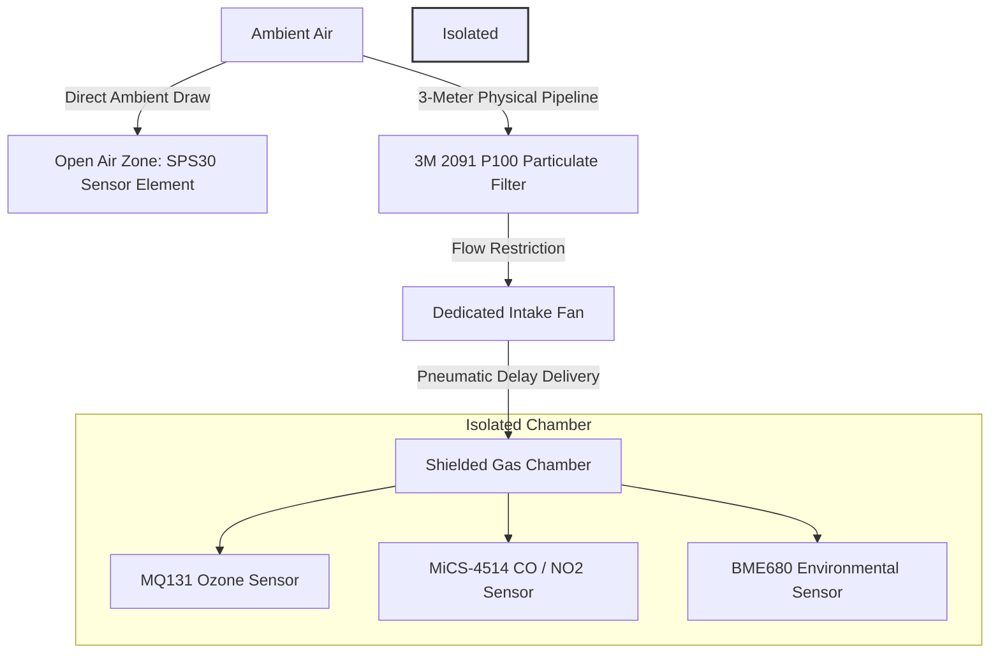
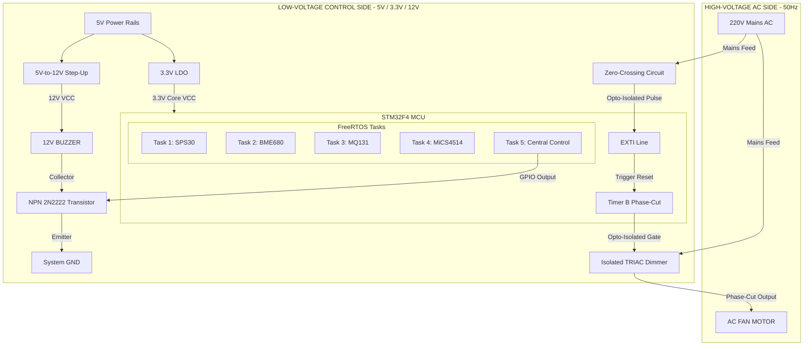
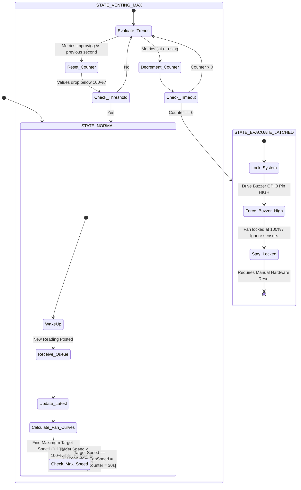
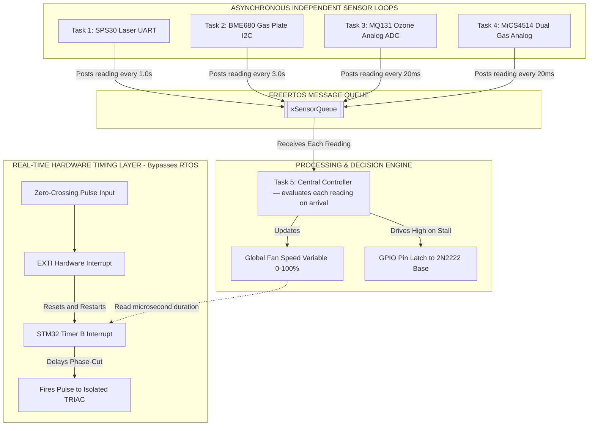

# ClearAir — Intelligent AC Vent Fan Controller

An industrial-grade, real-time environmental control and safety monitoring system running on the **STM32F4** platform. The project is designed to capture ambient air particulates and track highly toxic electrode gases generated during industrial processes (such as welding, EDM, or plasma cutting) to dynamically regulate an AC ventilation fan using a solid-state TRIAC module.

> **Migration note:** This project is planned to migrate to **STM32G4** in a future revision.

---

## 🚀 System Architecture Overview

To protect sensitive metal-oxide gas sensors from destructive metallic dust and electrode debris while keeping ambient tracking responsive, ClearAir uses a **dual-zone sampling topology**:

*   **Ambient Air Zone:** The `SPS30` particulate matter sensor rests directly in unshielded ambient air to capture raw particulate mass values before any extraction or filtration happens.
*   **Shielded Gas Chamber:** The `MQ131`, `MiCS-4514`, and `BME680` sensors are isolated inside an analytical testing container. An intake fan pulls air through a 3-meter tube and draws it across a **3M 2091 P100 filter**. This removes 99.97% of airborne dust and metallic shards, delivering clean target gases to the metal-oxide sensor elements.

---

## ⚡ Power & Logic Integration

*   **External 5V Rail:** The STM32 board and all high-draw sensor sub-components are powered by a dedicated, regulated external 5V supply line.
*   **Electrical Noise Isolation:** The internal 5V heating elements of the gas sensors are powered directly from the external 5V supply rail rather than drawing from the MCU. This layout keeps heavy electrical switching current ripples completely away from the sensitive STM32 analog circuitry.
*   **Logic Interfacing:** The `I2C3` bus uses 4.7 kΩ pull-up resistors tied strictly to the STM32's 3.3V rail. High-voltage analog sensor outputs are routed through passive hardware voltage dividers to safely drop raw 5V signals under the 3.3V ADC limit.
*   **I2C Level Translation (planned):** A bidirectional 3.3V↔5V I2C level shifter is planned to bridge the STM32's 3.3V `I2C3` bus to a secondary **Arduino Micro** (already in stock) running on its native 5V logic domain, allowing both boards to share the same physical bus without over-driving the STM32's 3.3V-rated I2C lines. The Arduino Micro would drive a planned visualization/alert stage — an LED array or 7-segment display plus a buzzer — for per-sensor status indication.

---

## 📊 Target Gases & Environmental Indices

| Sensor | Target Media | Application / Electrode Coverage |
| :--- | :--- | :--- |
| **SPS30** | PM1.0, PM2.5, PM4.0, PM10 | Monitors metallic fumes, hexavalent chromium particulates, manganese dust, and airborne ash before it reaches the filters. |
| **MQ131** | Ozone ($O_3$) | Tracks $O_3$ gas generated by intense ultraviolet (UV) radiation when open electric arcs ionize ambient oxygen molecules. |
| **MiCS-4514** | Carbon Monoxide ($CO$) & Nitrogen Dioxide ($NO_2$) | Measures toxic shielding gas breakdown products, incomplete combustion ($CO$), and high-temperature thermal fixation byproducts ($NO_2$). |
| **BME680** | VOCs, Sulfur Compounds, $H_2$ Gas | Utilizes the **Bosch BSEC2 library** to track complex vapor emissions coming from cutting fluids, dielectric oils, and insulating resins. |

### Implemented Control Indices
*   **Chamber Air Quality Index (AQI):** A multi-variable matrix blending $CO$, $NO_2$, and BSEC2 $VOC$ data into a single risk metric to determine basic ventilation speeds.
*   **Oxidizing Gas Index (OGI):** A high-priority index tracking the sum of $O_3$ and $NO_2$ gas streams, mirroring extreme electrode ionization states.
*   **Filter Loading Index (FLI):** Calculated from the delta ratio between raw outdoor $SPS30$ values and internal $BME680$ barometric pressure drops, triggering a warning when the physical filter element is clogged.

---

## 🛠️ Hardware Peripheral Mapping

| Subsystem Component | Peripheral Identifier | Physical Hardware Pin | Hardware Mode & Execution Profile |
| :--- |:----------------------|:----------------------| :--- |
| **SPS30 + BME680** | I2C3                  | PA8 (SCL), PC9 (SDA) | Standard Open-Drain. |
| **MQ-131 Output** | ADC1_IN0              | PA0                   | Single-Ended Analog Input (Requires External Divider). |
| **MiCS-4514 (CO)** | ADC1_IN1              | PA1                   | Single-Ended Analog Input ($V_{OUT1}$). |
| **MiCS-4514 ($NO_2$)** | ADC1_IN7              | PA7                   | Single-Ended Analog Input ($V_{OUT2}$). |
| **RobotDyn ZC Input** | EXTI16                | PC6                   | Digital Input, configured for falling-edge interrupts. |
| **RobotDyn Gate Out** | GPIO Output           | PC7                   | Push-Pull, High-Speed Output driven by Timer ISR. |
| **Phase-Delay Tracking** | TIM3                  | Internal              | One-Pulse Hardware Mode (Triggered by ZC Interrupt). |
| **OS Kernel Clock** | SysTick               | Internal              | Dedicated exclusively to FreeRTOS Scheduler operations. |
| **HAL Timebase** | TIM6                  | Internal              | Dedicated strictly to standard HAL delay and timeout loops. |
| **Debug & Telemetry** | USART2                | PA2 (TX), PA3 (RX)    | Asynchronous communication mapped to ST-LINK VCP. |
| **Status Indicator** | GPIO Output           | PA5                   | Mapped to onboard status LED. |
| **I2C Level Shifter (planned)** | I2C3 (Bridged)        | PA8 (SCL), PC9 (SDA)  | Bidirectional 3.3V↔5V translator bridging `I2C3` to the Arduino Micro's 5V I2C bus. |
| **Visualization Controller (planned)** | Arduino Micro (I2C Slave) | External 5V Domain | Planned status/alert output stage using an existing Arduino Micro already in stock — driving an LED array or 7-segment display, plus a buzzer, for per-sensor nominal/fault indication. Offloads this from the STM32; would receive status/command bytes over the level-shifted `I2C3` bus. |

---

## 🧠 Software Architecture

The software stack runs on top of a priority-preemptive FreeRTOS kernel. It segments slower sensor processing delays from the real-time, time-critical AC phase-angle modulation routines:

### Central Safety Loop State Machine

### Execution Strategy
*   **Low-Overhead Data Capture:** `ADC1` runs continuously in multi-channel Scan Mode handled via DMA. It updates a local 3-element array in RAM with fresh voltages from the `MQ131` and `MiCS-4514` sensors without generating any CPU overhead.
*   **AC Phase Control Loop:**
    1. The AC power wave crosses its zero-voltage baseline, instantly pulling the RobotDyn Zero-Cross input pin (`PA10`) low.
    2. An external interrupt (`EXTI10`) triggers on the falling edge, preempting running tasks.
    3. The EXTI hardware interrupt handler kicks off `TIM2` operating in One-Pulse Mode, configured with the current fan target phase delay value.
    4. Upon timer expiration, a hardware interrupt toggles the TRIAC firing gate pin (`PA6`) high for a brief, fixed duration to pulse the fan.

---

### Message-queue asynchronous flow

## 📉 Compensation & Normalization Models

*   **Pneumatic Lag Tracking:** Air taking a 3-meter path through a dense P100 filter introduces a noticeable physical delay. The control software channels open-air $SPS30$ data packets into an internal software ring buffer. This matches delayed chamber sensor gas metrics with historical particulate conditions.
*   **Environmental Compensation:** Temperature, humidity, and barometric drops alter the baseline resistance ($R_0$) of metal-oxide sensors. ClearAir feeds live ambient calculation layers from the Bosch BSEC2 library into the conversion algorithms to scale raw sensor voltages ($V_{OUT}$ to PPM) relative to the physical conditions inside the chamber.

---

## 🚨 Safety Core & Fail-Safes

*   **Loss of Signal Safeguard:** If the `I2C3` communication lines stall, or if the `ADC1` DMA buffer fails to cycle for 5 consecutive periods, the firmware shifts into an Emergency Override state, locking the TRIAC delay to 0% to force the exhaust fan to run continuously at 100% capacity.
*   **Electrical Fault Monitoring:** If any analog channel detects an out-of-bounds voltage (0V matching a short circuit, or 3.3V matching a ruptured line), the event is reported over telemetry and the ventilation loop steps up to full speed.
*   **Non-Volatile Baseline Recovery:** The system stores the active BSEC2 engine state data matrix to internal internal flash sectors every hour to prevent calibration degradation during unexpected system power losses.
